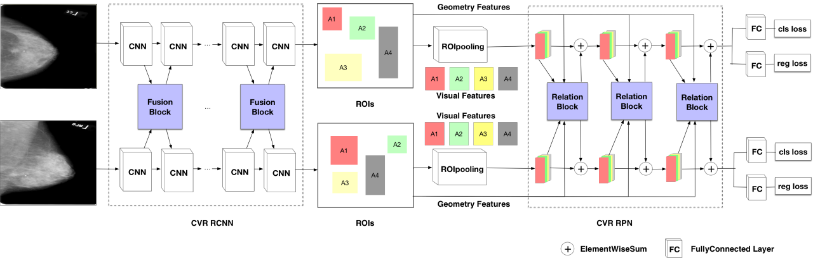

# DALM: Deep learning-enabled Accurate Layer Mapping of 2D materials
## Introduction
This is a public repository for deep learning-based accurate segmentation of 2D materials. The codes were mainly developed by Mr. Zhutong Jiang (Email: zhutongj@gmail.com) in the starting stage, and were further polished by Mr. Hongwei Li (Email: hongwei.li@tum.de) and Mr. Xingchen Dong (xingchen.dong@tum.de). 


<b>Input</b>: hyperspectral images (2+1 D) and RGB images (2D) \
<b>Output</b>: multi-class segmentation map of 2D materials \
<b>Model</b>: a two-stream convolutional neural network that fuses the dual-modality information \
<b>Key components</b>: 3D convolution, 2D convolution, 'Squeeze and Excitation' block \
<b>Loss function</b>: Dice-coefficient loss \
<b>Data augmentation</b>: random rotation, randomly cropping and randomly flipping 

The key architecture is defined in:
```
model.py
```
where the 3D and 2D features after convolutional layers and 'Squeeze and Excitation' blocks are fused into one network and trained in an end-to-end manner. We also provide the codes of different fusion strategies in *model.py* if you wish to compare them. 


## How to train the network? 
First, you will need to prepare your dataset, following the steps introduced in the manuscript. \
Specifically, in our work the dimensions of the inputs are <b>[96, 96, 221, 1]</b> and <b>[96, 96, 3]</b> for hyperspectral images and RGB images (3 channels) respectively. To download the dataset and get to know the details, you can read the [description](https://github.com/hongweilibran/DALM/blob/main/ReadME_dataset.md) here.
Secondly, prepare your hardware and install requirements. GPU with 12GB or 24GB with cuda version 9.1 all work well. Then please install requirements via

```
pip install -r requirements.txt

```
Thirdly, start to train the network with demo codes named 'train_net.py' via:
```
python train_net.py

```
## Inference stage

When the training is done, the model and training curve are saved. 
Then you can have a look at the results via:  
```
python test_net.py

```
Then you will get some numbers of the evaluation metrics include Dice scores and Hausdorff distance.


