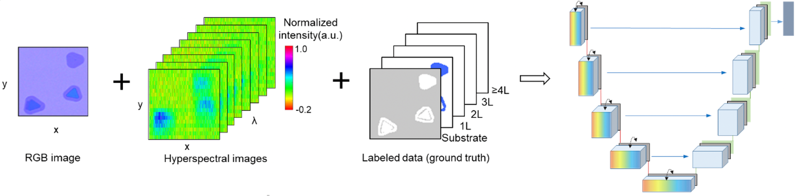

# DALM: Deep learning-enabled Accurate Layer Mapping of 2D materials
## Introduction
This is a public repository for deep learning-based accurate segmentation of 2D materials. The codes were mainly developed by Mr. Zhutong Jiang (Email: zhutongj@gmail.com) in the starting stage, and were further polished by Mr. Hongwei Li (Email: hongwei.li@tum.de) and Mr. Xingchen Dong (xingchen.dong@tum.de). 


<b>Input</b>: hyperspectral images (2+1 D) and RGB images (2D) \
<b>Output</b>: multi-class segmentation map of 2D materials \
<b>Model</b>: a two-stream convolutional neural network that fuses the dual-modality information \
<b>Key components</b>: 3D convolution, 2D convolution, 'Squeeze and Excitation' block \
<b>Loss function</b>: Dice-coefficient loss \ 
<b>Data augmentation</b>: random rotation, randomly cropping and randomly flipping


Specifically, in our work the dimensions of the inputs are <b>[96, 96, 128, 1]</b>, and <b>[96, 96, 3]</b> for hyperspectral and RGB images respectively.  
The key architecture is defined in
```
model.py
```
where the 3D and 2D image features are fused in one network and trained in an end-to-end manner. We also provide the codes of different fusion strategies if you wish to compare them. 


## How to train the network? 
First, you will need to prepare your dataset. 
